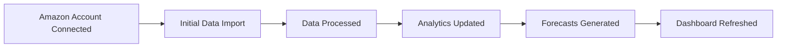

# Domain-Driven Design Architecture Plan

## 🏗️ DDD Structure Overview

Based on the core business domains identified in PROJECT-OVERVIEW.md and competitive analysis, here's the proposed DDD architecture:

```
src/
├── domain/                          # Core business logic
│   ├── marketplace/                 # Marketplace integration bounded context
│   │   ├── amazon/                 # Amazon-specific implementation
│   │   │   ├── entities/
│   │   │   │   ├── SellerAccount.ts
│   │   │   │   ├── Marketplace.ts
│   │   │   │   └── ApiCredentials.ts
│   │   │   ├── value-objects/
│   │   │   │   ├── MarketplaceId.ts
│   │   │   │   ├── SellerId.ts
│   │   │   │   └── ApiEndpoint.ts
│   │   │   ├── services/
│   │   │   │   ├── SpApiAuthService.ts
│   │   │   │   ├── DataSyncService.ts
│   │   │   │   └── WebhookService.ts
│   │   │   ├── repositories/
│   │   │   │   └── ISellerAccountRepository.ts
│   │   │   └── events/
│   │   │       ├── AccountConnectedEvent.ts
│   │   │       └── SyncCompletedEvent.ts
│   │   └── shared/
│   │       └── IMarketplaceIntegration.ts
│   │
│   ├── analytics/                   # Analytics bounded context
│   │   ├── plan-vs-fact/           # Unique feature
│   │   │   ├── entities/
│   │   │   │   ├── Plan.ts
│   │   │   │   ├── ActualResult.ts
│   │   │   │   └── Variance.ts
│   │   │   ├── value-objects/
│   │   │   │   ├── PlanPeriod.ts
│   │   │   │   ├── MetricType.ts
│   │   │   │   └── VarianceThreshold.ts
│   │   │   └── services/
│   │   │       ├── PlanCreationService.ts
│   │   │       ├── VarianceAnalysisService.ts
│   │   │       └── PerformanceGapService.ts
│   │   │
│   │   ├── ltv-cohort/             # MVP feature
│   │   │   ├── entities/
│   │   │   │   ├── CustomerCohort.ts
│   │   │   │   ├── LifetimeValue.ts
│   │   │   │   └── RetentionMetric.ts
│   │   │   ├── value-objects/
│   │   │   │   ├── CohortPeriod.ts
│   │   │   │   ├── CustomerSegment.ts
│   │   │   │   └── ValueCalculation.ts
│   │   │   └── services/
│   │   │       ├── CohortAnalysisService.ts
│   │   │       ├── LtvCalculationService.ts
│   │   │       └── RetentionService.ts
│   │   │
│   │   └── shared/
│   │       ├── IAnalyticsEngine.ts
│   │       └── MetricDefinitions.ts
│   │
│   ├── forecasting/                 # Forecasting bounded context
│   │   ├── entities/
│   │   │   ├── Forecast.ts
│   │   │   ├── ForecastModel.ts
│   │   │   └── Prediction.ts
│   │   ├── value-objects/
│   │   │   ├── TimeHorizon.ts
│   │   │   ├── ConfidenceInterval.ts
│   │   │   └── SeasonalityPattern.ts
│   │   ├── services/
│   │   │   ├── RevenueForecasterService.ts
│   │   │   ├── InventoryForecasterService.ts
│   │   │   ├── CashFlowForecasterService.ts
│   │   │   └── AiModelService.ts
│   │   └── algorithms/
│   │       ├── TimeSeriesAnalysis.ts
│   │       ├── SeasonalDecomposition.ts
│   │       └── MachineLearningModels.ts
│   │
│   ├── planning/                    # Strategic planning context
│   │   ├── entities/
│   │   │   ├── StrategicPlan.ts
│   │   │   ├── Goal.ts
│   │   │   └── Scenario.ts
│   │   ├── value-objects/
│   │   │   ├── PlanningHorizon.ts
│   │   │   ├── KpiTarget.ts
│   │   │   └── RiskAssessment.ts
│   │   └── services/
│   │       ├── GoalSettingService.ts
│   │       ├── ScenarioAnalysisService.ts
│   │       └── WhatIfAnalysisService.ts
│   │
│   └── data-processing/             # ETL bounded context
│       ├── entities/
│       │   ├── DataPipeline.ts
│       │   ├── TransformationRule.ts
│       │   └── DataQualityCheck.ts
│       ├── value-objects/
│       │   ├── DataSource.ts
│       │   ├── SyncSchedule.ts
│       │   └── ProcessingStatus.ts
│       ├── services/
│       │   ├── InitialImportService.ts
│       │   ├── IncrementalSyncService.ts
│       │   ├── DataTransformationService.ts
│       │   └── DataValidationService.ts
│       └── jobs/
│           ├── ImportJob.ts
│           ├── TransformJob.ts
│           └── AggregationJob.ts
│
├── application/                     # Application services layer
│   ├── marketplace/
│   │   ├── ConnectAmazonAccountUseCase.ts
│   │   ├── SyncMarketplaceDataUseCase.ts
│   │   └── RefreshApiTokenUseCase.ts
│   ├── analytics/
│   │   ├── CreatePlanUseCase.ts
│   │   ├── AnalyzeVarianceUseCase.ts
│   │   ├── CalculateLtvUseCase.ts
│   │   └── GenerateCohortReportUseCase.ts
│   ├── forecasting/
│   │   ├── GenerateForecastUseCase.ts
│   │   ├── UpdateForecastModelUseCase.ts
│   │   └── RunWhatIfScenarioUseCase.ts
│   └── data-processing/
│       ├── InitiateDataImportUseCase.ts
│       ├── ProcessDataBatchUseCase.ts
│       └── ValidateDataQualityUseCase.ts
│
├── infrastructure/                  # Technical implementation
│   ├── marketplace/
│   │   ├── amazon/
│   │   │   ├── SpApiClient.ts
│   │   │   ├── SpApiAuth.ts
│   │   │   └── RateLimiter.ts
│   │   └── airbyte/
│   │       ├── AirbyteConnector.ts
│   │       └── SyncOrchestrator.ts
│   ├── persistence/
│   │   ├── repositories/
│   │   │   ├── DrizzleSellerAccountRepository.ts
│   │   │   ├── DrizzlePlanRepository.ts
│   │   │   └── DrizzleForecastRepository.ts
│   │   └── migrations/
│   └── external/
│       ├── queue/
│       │   └── BullMqJobQueue.ts
│       ├── cache/
│       │   └── RedisCache.ts
│       └── storage/
│           └── CloudStorage.ts
│
├── presentation/                    # UI/API layer
│   ├── api/
│   │   ├── marketplace/
│   │   │   └── route.ts
│   │   ├── analytics/
│   │   │   ├── plan-vs-fact/
│   │   │   └── ltv-cohort/
│   │   └── forecasting/
│   ├── dashboards/
│   │   ├── executive/              # C-level overview
│   │   │   ├── components/
│   │   │   └── page.tsx
│   │   ├── plan-vs-fact/          # Plan vs Fact dashboard
│   │   │   ├── components/
│   │   │   │   ├── VarianceChart.tsx
│   │   │   │   ├── PerformanceGapAnalysis.tsx
│   │   │   │   └── PlanEditor.tsx
│   │   │   └── page.tsx
│   │   ├── ltv-analytics/         # LTV Cohort dashboard
│   │   │   ├── components/
│   │   │   │   ├── CohortMatrix.tsx
│   │   │   │   ├── RetentionCurve.tsx
│   │   │   │   └── ValueDistribution.tsx
│   │   │   └── page.tsx
│   │   ├── forecasting/           # Forecasting dashboard
│   │   │   ├── components/
│   │   │   │   ├── ForecastChart.tsx
│   │   │   │   ├── ScenarioComparison.tsx
│   │   │   │   └── ConfidenceIntervals.tsx
│   │   │   └── page.tsx
│   │   └── operational/           # Day-to-day operations
│   │       ├── inventory/
│   │       ├── sales/
│   │       └── profitability/
│   └── components/
│       └── shared/
│           ├── charts/
│           ├── filters/
│           └── exports/
│
└── shared/                         # Shared kernel
    ├── types/
    │   ├── Money.ts
    │   ├── DateRange.ts
    │   └── Percentage.ts
    ├── utils/
    │   ├── calculations/
    │   └── formatters/
    └── events/
        ├── EventBus.ts
        └── DomainEvent.ts
```

## 📋 Key Design Decisions

### 1. Bounded Contexts

**Marketplace Integration**
- Handles all external marketplace connections
- Amazon-specific implementation with interface for future marketplaces
- Manages authentication, rate limiting, webhooks

**Analytics**
- Plan vs. Fact analysis (unique differentiator)
- LTV Cohort analytics (MVP feature)
- Core business intelligence logic

**Forecasting**
- AI-powered predictions
- Multiple forecasting models
- Scenario analysis

**Planning**
- Strategic planning tools
- Goal setting and tracking
- What-if analysis

**Data Processing**
- ETL pipelines
- Data quality management
- Batch processing

### 2. Implementation Strategy

**Phase 1: Foundation**
```typescript
// Start with these core pieces
- domain/marketplace/amazon/
- infrastructure/marketplace/amazon/
- application/marketplace/
- Basic dashboard structure
```

**Phase 2: Core Features**
```typescript
// Add analytics capabilities
- domain/analytics/plan-vs-fact/
- domain/analytics/ltv-cohort/
- Corresponding dashboards
```

**Phase 3: Advanced Features**
```typescript
// Add forecasting and planning
- domain/forecasting/
- domain/planning/
- AI/ML integration
```

### 3. Domain Events Flow



### 4. Dashboard Architecture

**Executive Dashboard**
- High-level KPIs
- Plan vs. Fact summary
- LTV trends
- Forecast accuracy

**Plan vs. Fact Dashboard**
- Detailed variance analysis
- Performance gap identification
- Plan creation/editing
- Historical comparisons

**LTV Analytics Dashboard**
- Cohort matrices
- Retention curves
- Customer value distribution
- Acquisition ROI

**Forecasting Dashboard**
- Revenue predictions
- Inventory planning
- Cash flow projections
- Scenario comparisons

## 🔧 Technical Patterns

### Repository Pattern
```typescript
interface ISellerAccountRepository {
  findById(id: SellerId): Promise<SellerAccount>;
  save(account: SellerAccount): Promise<void>;
  findByOrganization(orgId: string): Promise<SellerAccount[]>;
}
```

### Use Case Pattern
```typescript
class ConnectAmazonAccountUseCase {
  async execute(command: ConnectAccountCommand): Promise<Result> {
    // Validate
    // Execute domain logic
    // Persist
    // Emit events
  }
}
```

### Value Object Pattern
```typescript
class MarketplaceId {
  constructor(private readonly value: string) {
    this.validate(value);
  }
  
  equals(other: MarketplaceId): boolean {
    return this.value === other.value;
  }
}
```

### Domain Event Pattern
```typescript
class AccountConnectedEvent extends DomainEvent {
  constructor(
    public readonly accountId: string,
    public readonly marketplaceId: string,
    public readonly timestamp: Date
  ) {
    super();
  }
}
```

## 🚀 Implementation Priority

1. **Week 1-2**: Marketplace Integration
   - Amazon SP-API connection
   - Authentication flow
   - Basic data sync

2. **Week 3-4**: Plan vs. Fact Analytics
   - Domain models
   - Variance calculations
   - Basic dashboard

3. **Week 5-6**: LTV Cohort Analytics
   - Cohort analysis engine
   - Value calculations
   - Dashboard components

4. **Week 7-8**: Forecasting Engine
   - Basic time series
   - Revenue forecasting
   - Visualization

This DDD structure ensures:
- Clear separation of concerns
- Scalability for new marketplaces
- Maintainable codebase
- Business logic isolation
- Testability

## 📊 Current Implementation Status (December 2024)

### ✅ Completed

#### Domain Layer
1. **Marketplace Integration (Amazon)**
   - ✅ `MarketplaceId.ts` - Value object with all Amazon marketplace IDs
   - ✅ `SellerId.ts` - Value object with validation
   - ✅ `ApiCredentials.ts` - Secure credential handling
   - ✅ `SellerAccount.ts` - Main entity with business logic
   - ✅ `ISellerAccountRepository.ts` - Repository interface
   - ✅ `AccountConnectedEvent.ts` - Domain event
   - ✅ `SyncCompletedEvent.ts` - Domain event with statistics

2. **Analytics (Plan vs. Fact)**
   - ✅ `PlanPeriod.ts` - Value object for time periods
   - ✅ `MetricType.ts` - Comprehensive metric definitions
   - ✅ `Plan.ts` - Planning entity with validation
   - ✅ `ActualResult.ts` - Actual data entity
   - ✅ `Variance.ts` - Variance calculation entity

3. **Shared Domain**
   - ✅ `DomainEvent.ts` - Base event class
   - ✅ Event structure established

#### Application Layer
- ✅ `ConnectAmazonAccountUseCase.ts` - First use case implemented

### 🚧 In Progress

1. **Infrastructure Layer**
   - ⏳ Drizzle repository implementations
   - ⏳ SP-API client implementation
   - ⏳ Rate limiting and retry logic
   - ⏳ Airbyte connector setup

2. **Additional Use Cases**
   - ⏳ `SyncMarketplaceDataUseCase`
   - ⏳ `CreatePlanUseCase`
   - ⏳ `AnalyzeVarianceUseCase`

### 📅 Next Steps

#### Immediate (This Week)
1. Implement `DrizzleSellerAccountRepository`
2. Create SP-API client wrapper
3. Build authentication flow UI
4. Set up data sync infrastructure

#### Short Term (Next 2 Weeks)
1. Complete Plan vs. Fact dashboard UI
2. Implement data processing pipeline
3. Create initial import functionality
4. Build variance analysis visualization

#### Medium Term (Next Month)
1. LTV cohort analytics implementation
2. Forecasting engine basics
3. Executive dashboard
4. Performance optimization

### 📈 Progress Tracking

- **Phase 1: Foundation** - 80% Complete
  - ✅ Domain folder structure
  - ✅ Core entities and value objects
  - ✅ Domain events
  - ⏳ Repository implementations
  - ⏳ API authentication flow

- **Phase 2: Data Processing** - 0% Complete
  - ⏳ Initial import service
  - ⏳ Incremental sync
  - ⏳ Data transformation
  - ⏳ Airbyte integration

- **Phase 3: Core Analytics** - 40% Complete
  - ✅ Plan vs. Fact domain models
  - ✅ Variance calculation logic
  - ⏳ LTV cohort models
  - ⏳ Analytics services

- **Phase 4: Dashboards** - 0% Complete
  - ⏳ Executive dashboard
  - ⏳ Plan vs. Fact UI
  - ⏳ LTV analytics UI
  - ⏳ Forecasting UI

- **Phase 5: Advanced Features** - 0% Complete
  - ⏳ AI forecasting
  - ⏳ Strategic planning
  - ⏳ What-if analysis
  - ⏳ Scenario comparison

### 🔧 Technical Decisions Made

1. **Value Objects**: Immutable with validation in constructor
2. **Entities**: Private constructors with static factory methods
3. **Events**: Inherit from base DomainEvent class
4. **Use Cases**: Return result objects with success/error states
5. **Repository Pattern**: Interfaces in domain, implementations in infrastructure

### 📝 Notes

- Following strict DDD principles with clear bounded contexts
- Each bounded context is independent and can evolve separately
- Domain layer has no dependencies on infrastructure
- All business logic contained within domain entities and services
- Event-driven architecture prepared for future scalability